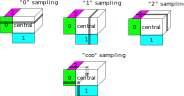

<div align="center">
<h1>h5torch</h1>

HDF5 data utilities for PyTorch.


[](https://pypi.python.org/pypi/h5torch/)
[](https://github.com/gdewael/h5torch/blob/main/LICENSE)

</div>

`h5torch` consists of two main parts: (1) `h5torch.File`: a wrapper around `h5py.File` as an interface to create HDF5 files compatible with (2) `h5torch.Dataset`, a wrapper around `torch.utils.data.Dataset`. As a library, `h5torch` establishes a "code" for how datasets should be saved, hence allowing dataloading of various machine learning data settings from a single dataset object, reducing boilerplate in your projects.

### but y tho?
Loading data from HDF5 files allows for efficient data-loading from an **on-disk** format, drastically reducing memory overhead. Additionally, you will find your datasets to be more **organized** using the HDF5 format, as everything is neatly arrayed in a single file.

## Install
Since PyTorch is a dependency of `h5torch`, we recommend [installing PyTorch](https://pytorch.org/get-started/locally/) independently first, as your system may require a specific version (e.g. CUDA drivers).

After PyTorch installation, `h5torch` can be installed using `pip`
```bash
pip install h5torch
```


### Package concepts

#### Storing

The main idea behind `h5torch` is that datasets can usually be formulated as being aligned to a central object. E.g. in a classical supervised learning setup, features/inputs are aligned to a label vector/matrix. In recommender systems, a score matrix is the central object, with features aligned to rows and columns.

`h5torch` allows creating and reading HDF5 datasets for use in PyTorch using this dogma. When creating a new dataset, the first data object that should be registered is the `central` object. The type of `central` object is flexible:

- `N-D`: for regular dense data. The number of dimensions in this object will dictate how many possible aligned axes can exist.
- `coo`: The sparse variant as `N-D`. The number of dimensions here can be arbitrary high.
- `csr`: For sparse 2D arrays, this central data type can only have 2 aligned axes and can only be sampled along the first dimension
- `vlen`: For variable length 1D arrays. This central data type can only have one aligned axis (0).
- `separate`: For objects that are better stored in separate groups instead of as one dataset. An example is variable shape N-D objects such as variably-sized images. This central data type can only have one aligned axis (0).

Along this central object, axis objects can be aligned. The first dimension length of any axis object must correspond to the length of the central data object to that dimension. For example, a central data object of shape (50, 40) can only have 50-length and 40-length objects aligned to its first and second axis, respectively. For axis objects, these possibilities are available:

- `N-D`: Can have arbitrary number of dimensions. E.g. equally-sized images: `(N, 3, H, W)`.
- `csr`: Max 2 dimensions, rows will be sampled. E.g. A sparse scRNA-seq count matrix
- `vlen`: Variable length 1D arrays. E.g. Tokenized text as variable length arrays of integers.
- `separate`: For objects that are better stored in separate groups instead of as one dataset. An example is variable shape N-D objects such as variably-sized images.

Note there is no support for `coo` data type for aligned objects, that is because aligned axis objects require efficient indexing along their first dimension.

Also note that there is no limit on the number of data objects aligned to an axis. For example, in the case of images aligned to a central label vector, extra information of every image can be added such as the URL, the date said image was taken, the geolocation of that image, ...

Besides the central and axis objects, you can also store `unstructured` data which can be any length or dimension and follow any of the above-mentioned data types (including `coo`). This could for example be a vocabularium vector or the names of classes...

#### Sampling

Once a dataset is created using `h5torch.File`, it can be used as a PyTorch Dataset using `h5torch.Dataset`. Sampling can occur along any of the axes in the central object, upon which the corresponding indices in the objects aligned to that axis are also sampled. Alternatively, `coo` sampling (available for `N-D` and `coo`-type central objects) samples one specific element of the central dataset, along with the corresponding indices of all axis-aligned objects.



## Usage

The most simple use-case is a ML setting with a 2-D `X` matrix as central object with corresponding labels `y` along the first axis.

```python
import h5torch
import numpy as np
f = h5torch.File("example.h5t", "w")
X = np.random.randn(100, 15)
y = np.random.rand(100)
f.register(X, "central")
f.register(y, 0, name = "y")
f.close()

dataset = h5torch.Dataset("example.h5t")
dataset[5], len(dataset)
```

Note that labels `y` can also play the role of central object. Both are equivalent in this simple case.
```python
import h5torch
import numpy as np
f = h5torch.File("example.h5t", "w")
X = np.random.randn(100, 15)
y = np.random.rand(100)
f.register(y, "central")
f.register(X, 0, name = "X")
f.close()

dataset = h5torch.Dataset("example.h5t")
dataset[5], len(dataset)
```

An example with a 2-dimensional Y matrix (such as a score matrix), with objects aligned to both axes of the central matrix. Storing Y and sampling is performed in `"coo"` mode, meaning the length of the dataset is the number of nonzero elements in the score matrix, and a sample constitutes such a nonzero element, along with the stored information of the row and col of said element.
```python
import h5torch
import numpy as np
f = h5torch.File("example.h5t", "w")

Y = (np.random.rand(1000, 500) > 0.95).astype(int)
row_features = np.random.randn(1000, 15)
col_names = np.arange(500).astype(bytes)


f.register(Y, "central", mode = "coo")
f.register(row_features, 0, name = "row_features")
f.register(col_names, 1, name = "col_names")
f.close()

dataset = h5torch.Dataset("example.h5t", sampling = "coo")
dataset[5], len(dataset)
```
Note: `h5torch` does not limit the number of possible dimensions along its central data object (and hence also the number of axes to align objects to).


# Package roadmap
- [x] Implement typing
- [x] Provide data type conversion capabilities for registering datasets
- [x] Add support for custom samplers
- [x] Add support for making data splits
- [ ] Implement a collater for variable length objects
